# mow-your-commits

<picture>
  <source media="(prefers-color-scheme: dark)" srcset="docs/lawn-dark.svg">
  
</picture>

*(a made-up developer, rendered by `node scripts/render-svg.mjs --demo`. once the
`mow the lawn` workflow has run here, the owner's real lawn lives on the `output`
branch and this repo points at that instead.)*

🌱 Your GitHub contribution graph is a lawn. Mow it. A tiny browser game built with Three.js and canvas.

**Unmowed = overgrown doodle grass hiding the graph. Mowed = the clean GitHub tile
underneath.** Every cell is both a GitHub day square and a patch of grass: level 4 is a
hedge you can barely see the tile through, level 0 is bare dirt. Driving over a day cuts
it back to its exact GitHub green and pops up `+12` for the contributions you just found.
Mowing *is* the reveal.

Grass reads the *count*, not just the level: each day carries a `vigor` (where its count
sits inside its own level's range), so a 40-contribution day grows taller, denser and
darker than a 12 in the same green. The top 3% of your days are `heroic` and put up a
dandelion until you mow them.

## try it with your own username

**<https://evch1204.github.io/mow-your-commits/>**

Type your GitHub username in the box above the lawn (a login, an `@handle` or a
profile link) and it becomes your real graph. `?user=torvalds` mows somebody else's;
`?year=2025` picks a calendar year. Mow all 52 weeks and the end card gives you a
time, a brag line and a picture to post.

**Controls.** Click the lawn, then WASD or the arrow keys. In 3D, drag to look
around, scroll or pinch to zoom, double-click to recentre; `C` swaps the chase cam
for an overview of the whole year and `R` regrows. Toggle flat / 3D with the
buttons. On a phone there is an on-screen pad, and the flat lawn scrolls sideways
to follow the mower.

Two renderers share one model:

- `src/core/` — the lawn itself. Cells, mower physics, mowing detection, seasons,
  temperature by month, and the shared colour palette including `GRASS`/`grassFor`, the
  blade grammar both renderers draw from. No DOM, no rendering.
- `src/render2d/` — hand-drawn canvas version at the proportions of the real graph:
  52x7 rounded tiles on a dirt bed whose colour follows the climate of each column, month
  labels with a season doodle on top, Mon/Wed/Fri down the left, legend bottom right. The
  whole year's weather is on screen at once: snow over the winter columns, blossom over
  spring, rising dandelion fluff over summer, leaves over autumn.
- `src/render3d/` — Three.js version with cel shading, ink outlines, a "boiling" wobble
  shader and wind sway. Instanced tiles plus four tuft builds, one per level, scaled by
  the day's count. A gradient sky dome, distance fog, hills, trees that go bare, green,
  gold and snow-lined with the season, and a sun that climbs in summer and sits pale and
  low in winter. A riding mower with a driver, and weather that follows you: drive into
  winter and it starts snowing, into autumn and the leaves come down. Chase cam you can
  drag to look around, or press `C` for the overview shot of the whole year.

Type a GitHub username in the box above the lawn and it becomes that account's real
graph. Pick a year from the list beside the lawn, just like on a GitHub profile: the
years offered are exactly the years that profile's own year picker shows. The rolling
"last year" is 52 weeks; a calendar year is GitHub's 53- or 54-column grid, with void
cells before 1 Jan and after 31 Dec (and after today, in the current year) that are
drawn as nothing and can't be mowed.

## Run

```
npm install
npm run dev
```

```
npm run build          # dist/ uses relative paths, so it works on GitHub Pages
node scripts/smoke.mjs # pure-node assertions over the sim + the data layer
node scripts/smoke.mjs --live torvalds   # also hits the real contributions API

# the README pictures, without a browser and without node_modules
node scripts/render-svg.mjs --demo --outputs "docs/lawn.svg
docs/lawn-dark.svg?theme=dark"
```

### Screenshots

```
npm run build
npx vite preview --port 4173 --strictPort
chrome --headless=new --disable-gpu --use-gl=angle --use-angle=swiftshader \
  --enable-unsafe-swiftshader --hide-scrollbars --window-size=1000,900 \
  --virtual-time-budget=6000 --screenshot=out.png \
  "http://localhost:4173/?view=flat&autodrive=1"
```

Headless Chrome clamps its window to 500px wide, so `--window-size=390,844` quietly
lies about phone width. For a real 390px shot, point it at a local file holding
`<iframe width="390" height="844" src="http://localhost:4173/?view=flat">` and use
`--window-size=500,844`.

### URL flags

| flag | what it does |
| --- | --- |
| `?view=flat` / `?view=deep` | which renderer to start in |
| `?year=2025` | pick a calendar year instead of the rolling 52 weeks |
| `?user=torvalds` | load a real account (a login, an @handle or a profile link) |
| `?seed=123` | a different fake year (deterministic), demo lawn only |
| `?autodrive=1` | debug: drives a demo lap down the year and back, for headless screenshots |
| `?cam=overview` | debug: start the 3D view on the overview camera |
| `?start=30` | debug: park the mower in a column (drive into a season) |
| `?yaw=45`, `?dist=6` | debug: preset look-around angle and camera distance |
| `?finish=1` | debug: mow everything before the first paint (end card) |
| `?og=1` | debug: hide the controls, the year list and the landing strips, for the 1200x630 social card |

Only `?user`, `?year` and `?seed` travel in a share link; the debug flags stay at home.

## put it in your profile

A GitHub Action mows your graph every night and commits the picture to a branch.
No tokens to create, no server, nothing to host.

1. Make a repo named after you (`you/you`) if you don't have one.
2. Add `.github/workflows/lawn.yml`:

```yaml
name: mow the lawn

on:
  schedule: [{ cron: '0 3 * * *' }]
  workflow_dispatch:
  push: { branches: [main] }

permissions: { contents: write }

jobs:
  mow:
    runs-on: ubuntu-latest
    steps:
      - uses: evch1204/mow-your-commits@v1
        with:
          github_user_name: ${{ github.repository_owner }}
          outputs: |
            dist/lawn.svg
            dist/lawn-dark.svg?theme=dark

      - uses: crazy-max/ghaction-github-pages@v4
        with: { target_branch: output, build_dir: dist }
        env: { GITHUB_TOKEN: "${{ secrets.GITHUB_TOKEN }}" }
```

3. Run it once from the Actions tab, then paste this into your README:

```html
<picture>
  <source media="(prefers-color-scheme: dark)" srcset="https://raw.githubusercontent.com/USER/USER/output/lawn-dark.svg">
  
</picture>
```

The page has a **copy workflow** and a **copy markdown** button that fill in your
username for you.

Each `outputs` line is a path plus options as a query string:

| option | values | what it does |
| --- | --- | --- |
| `theme` | `light` (default), `dark` | GitHub's own dark ramp on `#0D1117` |
| `year` | `2025` | a calendar year instead of the rolling 52 weeks |
| `mowed` | `0`..`1` (default `0.5`), `as-is` | how much is already cut |
| `mower` | `0` | park the mower off the picture |
| `animate` | `1` | SMIL: the mower drives the half-mowed row on an 8 s loop |
| `caption` | text, or `0` for none | replaces "1,234 contributions in the last year" |

The data is GitHub's own `contributionsCollection` GraphQL calendar, read with the
default action token; without a token it falls back to
`github-contributions-api.jogruber.de`. Both go through `src/core/github.js` and
`src/core/contrib.js`, the same parser and the same grid the site uses, and
`src/export/svg.js` draws through `src/core/palette.js` - so the picture in your
README is the board on the page, not a lookalike. Full details in
[`action/README.md`](action/README.md).

## download

The **put your lawn in your README** section on the page has **download svg** and
**download png**, and the end card has **download png** for the lawn exactly as you
mowed it. Both use the same `src/export/svg.js` the Action does, so the file you get
is the picture you were looking at. Or render one yourself:

```
node scripts/render-svg.mjs --user torvalds --outputs "out/lawn.svg"
node scripts/render-svg.mjs --demo --outputs "out/a.svg\nout/b.svg?theme=dark&animate=1"
```

`render-svg.mjs` imports only `src/core/*` and `src/export/*`, which have no
dependencies, so it runs with `node_modules` deleted. That is what lets the Action
skip `npm ci`; keep it that way.

The exported SVG embeds the Latin subset of **Patrick Hand** by Patrick Wagesreiter
(SIL Open Font License 1.1) as a `data:` URI, because an `` SVG in a README
cannot load anything external.

## Real data

Type `torvalds`, `@torvalds` or `https://github.com/torvalds/` into the box above the
lawn (or open `?user=torvalds`) and the lawn becomes that account's real contribution
graph: GitHub's own levels, GitHub's own year list, days after today left blank. No
account, no token, no backend. A loaded account is remembered in the URL, so the link
is shareable; `back to the demo` puts the fake lawn back.

The site calls **`https://github-contributions-api.jogruber.de/v4/<login>`**, the one
CORS-open public mirror of the contribution graph (github.com itself sends no
`Access-Control-Allow-Origin`). Two requests per cold load: `?y=all` for the whole
history and the year list, `?y=last` for GitHub's rolling 53-week window. That API
caches for an hour and limits *uncached* requests to 10 per 10 seconds per IP, so the
site keeps its own `localStorage` cache: six accounts, fresh for an hour, usable for a
week if the API is unreachable. Organisations have no contribution graph and come back
as "not found".

```js
import { fetchContributions, parseUserInput } from './core/github.js';
import { daysForYear, daysForRolling } from './core/contrib.js';

const login = parseUserInput('https://github.com/torvalds/');   // -> 'torvalds'
const data = await fetchContributions(login, { today: '2026-09-08' });
// { days: [{date, count, level}], years: [2026, ..., 2011], totals, last }

createLawn(daysForYear(data.days, 2025, today), { year: 2025 });  // one calendar year
createLawn(daysForRolling(data.last), { year: null });            // the rolling window
```

`src/core/github.js` is pure: `fetch` and the storage are injectable, so it all runs
under node, and every failure is a `GithubError` with a `kind` the page turns into a
sentence (`invalid`, `notfound`, `ratelimited`, `network`, `malformed`, `token`).

### The optional token

Under **or paste a token** you can hand the page a GitHub token, and it queries
`api.github.com/graphql` (`contributionsCollection`) directly instead: no shared rate
limit, no third party, and your *own* account's private contributions are included. A
fine-grained personal access token with **no permissions at all** is enough.

The token is stored only in your browser (`localStorage`), sent only to
`api.github.com`, and never put in a URL — `?token=` is stripped from the address bar
on load. `forget` deletes it. If GitHub is unreachable the page falls back to the
public mirror; if the token is rejected it says so and changes nothing else.

### Without any of that

`generateFakeData(seed)` makes a plausible developer year: weekday-heavy, a sparse
January, a few multi-week streaks, one vacation gap and one heroic shipping week. That
is the demo lawn, and it stays on screen (and playable) while a real one is loading and
after any failure. `?seed=123` picks a different one.

`parseContributions()` in `src/core/contrib.js` still reads GitHub's own
`td[data-date][data-level]` table, for the browser-extension idea below.

## Next

- [ ] hand-drawn tuft and mower textures instead of procedural strokes
- [ ] extension: content script that swaps `.js-calendar-graph` for the lawn
- [ ] sound
- [x] share image export (SVG/PNG on the page, and a GitHub Action for your README)
