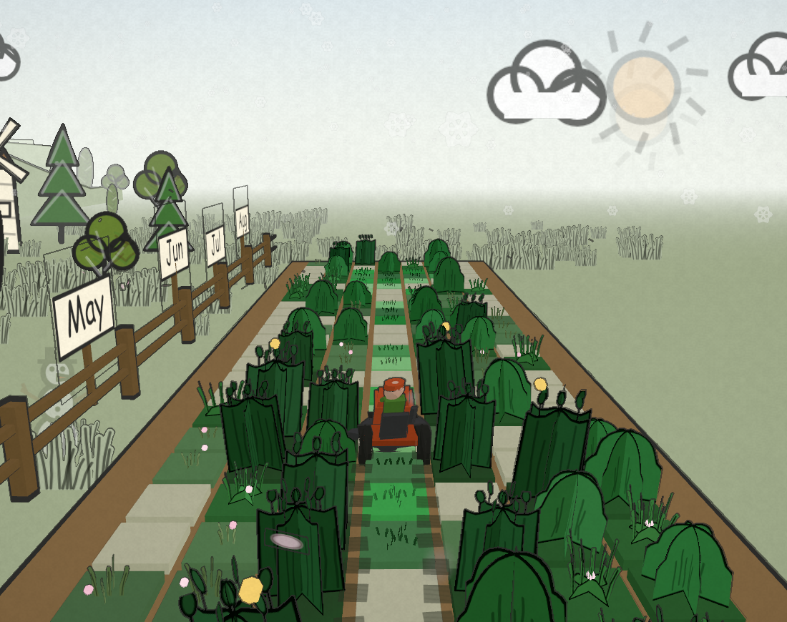
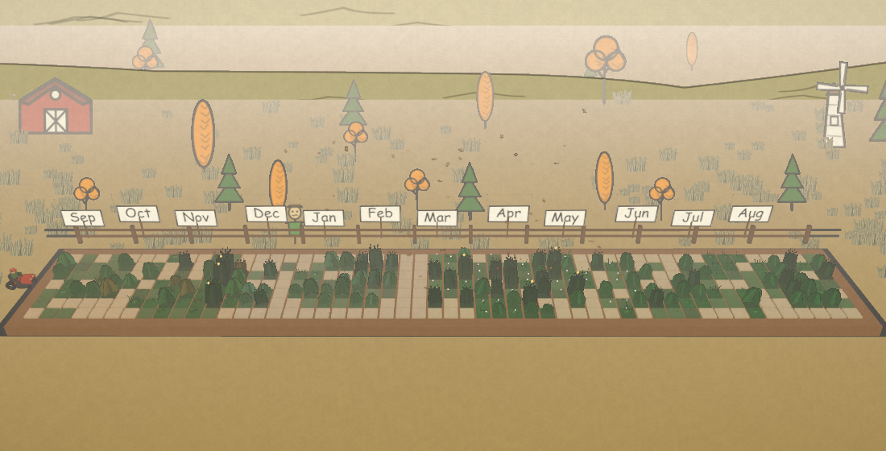
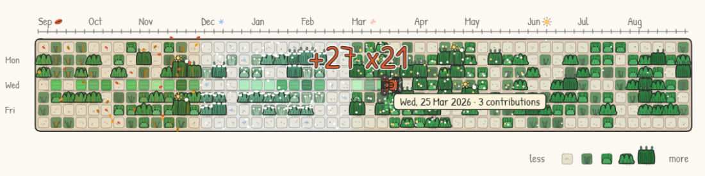
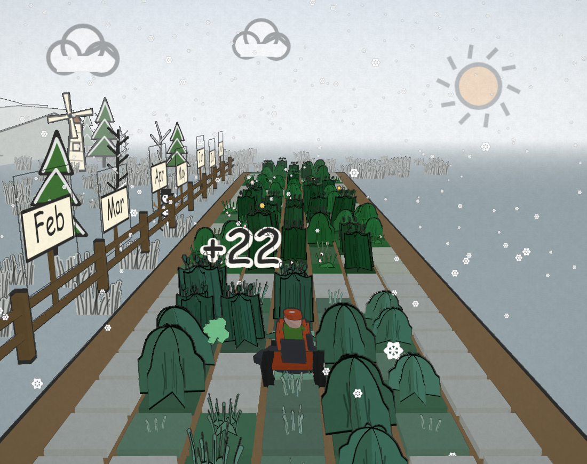

<h1 align="center">🌱 mow your commits</h1>

<p align="center">
  Your GitHub contribution graph is a lawn. Mow it.
</p>

<p align="center">
  <a href="https://evch1204.github.io/mow-your-commits/"><b>▶ play it with your own graph</b></a>
  &nbsp;·&nbsp;
  <a href="#put-it-in-your-readme">put it in your README</a>
  &nbsp;·&nbsp;
  <a href="#play-it">play</a>
  &nbsp;·&nbsp;
  <a href="#run-it-locally">run it locally</a>
</p>

<p align="center">
  <a href="LICENSE"></a>
  <a href="https://github.com/evch1204/mow-your-commits/stargazers"></a>
  
</p>

<p align="center">
  <picture>
    <source media="(prefers-color-scheme: dark)" srcset="docs/lawn-dark.svg">
    
  </picture>
</p>

Every day on your graph is a patch of grass. A quiet day sprouts; a heavy one grows a hedge
you can pick out from across the room. Drive the mower over a day and the real GitHub tile
pops out with the count. Mow all 52 weeks and you get a time to brag about.

Type any GitHub username on the site and it becomes that account's real graph. No login,
no token, nothing to install.

## Put it in your README

A GitHub Action mows your graph every night and commits the picture to your profile repo.
No tokens to create, no server, nothing to host. Light and dark, like GitHub's own graph.

**Three clicks.** Open [the site](https://evch1204.github.io/mow-your-commits/), type your
username, then work down the three steps under the lawn:

| | button | what happens |
| --- | --- | --- |
| 1 | **add the workflow to GitHub** | opens GitHub's own new-file editor with `.github/workflows/lawn.yml` already written into it. Nothing is saved until you press GitHub's commit button. |
| 2 | **run it once** | opens that workflow's page in your Actions tab. Press *Run workflow*. |
| 3 | **copy markdown** + **open your README** | paste the `<picture>` block at the top of your profile README. |

No `you/you` repo yet? Step 3 links to a pre-filled new-repo form. The name has to be
exactly your login — that is the repo GitHub shows on your profile.

<details>
<summary>or do it by hand</summary>

1. Make a repo named after you (`you/you`) if you don't have one.
2. Add `.github/workflows/lawn.yml`:

```yaml
name: mow the lawn

on:
  schedule: [{ cron: '0 3 * * *' }]
  workflow_dispatch:
  push: { branches: [main] }

permissions: { contents: write }

jobs:
  mow:
    runs-on: ubuntu-latest
    steps:
      - uses: evch1204/mow-your-commits@v1
        with:
          github_user_name: ${{ github.repository_owner }}
          outputs: |
            dist/lawn.svg?animate=1
            dist/lawn-dark.svg?theme=dark&animate=1

      - uses: crazy-max/ghaction-github-pages@v4
        with: { target_branch: output, build_dir: dist }
        env: { GITHUB_TOKEN: "${{ secrets.GITHUB_TOKEN }}" }
```

3. Run it once from the Actions tab, then paste this into your README (swap `USER` for
   your login):

```html
<picture>
  <source media="(prefers-color-scheme: dark)" srcset="https://raw.githubusercontent.com/USER/USER/output/lawn-dark.svg">
  
</picture>
```

The site's **copy workflow** button, under "or copy it yourself", hands you the same yaml.

</details>

### Options

The workflow above ships `?animate=1`, so the mower mows the whole year in passes, leaves
its tyre tracks behind it, drives off the right edge and the lawn regrows. Drop it for a still, half-mowed board. Just want the
graph? `?weather=0&bg=0` gives GitHub's exact greens on a transparent background, with no
seasons. Every option, one per output line:

| option | values | what it does |
| --- | --- | --- |
| `theme` | `light`, `dark` | GitHub's dark ramp on `#0D1117` |
| `animate` | `1` | the mower mows the whole year row by row, then it regrows (`mowed` is ignored) |
| `weather` | `0` | no seasons: no doodles, frost, leaves or blossom, and GitHub's exact greens |
| `bg` | `0` | no paper behind the board: a transparent picture |
| `year` | `2025` | a calendar year instead of the rolling 52 weeks |
| `mowed` | `0`..`1`, `as-is` | how much is already cut (default `0.5`) |
| `mower` | `0` | park the mower off the picture (ignored under `animate`) |
| `caption` | text, or `0` | replace "1,234 contributions in the last year" |

More in [`action/README.md`](action/README.md). Prefer a file? The site has **download
svg** and **download png**, and the end card downloads the lawn exactly as you mowed it.

## Play it

<table>
  <tr>
    <td></td>
    <td></td>
  </tr>
  <tr>
    <td></td>
    <td></td>
  </tr>
</table>

**Controls.** Click the lawn, then WASD or arrow keys. `C` for the overview shot, `R` to
regrow, drag to look around in 3D. On a phone there is a pad.

**Combo.** Cut another day within 0.9 s of the last one and the run climbs: `combo x7`
appears in the strip over the board from three up, and the end card keeps your best. It is
what turns a tidy sweep into a race.

**Sound.** The 🔇 button next to *regrow* turns on an engine that follows the throttle, a
snip per cut, a chime on one of your best days and a fanfare at the end. All of it is made
from oscillators — there is nothing to download — and the choice is remembered.

## Run it locally

```
npm install
npm run dev
```

Open the URL Vite prints, type a username into the box above the lawn, press **mow it**.
`?user=torvalds` in the address bar does the same. `?year=2025` picks a calendar year.

## How it works

- **Your data, no login.** The site reads the public contribution graph through a
  CORS-open mirror, so it works as a static page on GitHub Pages. Paste a fine-grained
  token with no permissions under "or paste a token" and it talks to GitHub's GraphQL API
  directly instead, private contributions included. The token stays in your browser and
  never touches a URL.
- **One sim, two renderers.** A pure, DOM-free model in `src/core` drives a hand-drawn
  canvas and a cel-shaded Three.js scene. Grass height and density follow the actual
  count, not just GitHub's four levels, and the best 3% of your days grow dandelions.
- **The README picture is the board.** The Action renders through the same code as the
  site with zero dependencies, so what lands in your profile is exactly what you mowed.
- **The install is a URL.** Step 1 is GitHub's own new-file editor with `?filename=` and
  `?value=` filled in, and step 3's fallback is `github.com/new?name=`. No app to
  authorise, no permissions to grant, nothing of yours held anywhere.

Developer notes, URL flags and the screenshot recipe: [`docs/DEV.md`](docs/DEV.md).

## Credits

Inspired by the [contribution snake](https://github.com/Platane/snk). Drawn in
[Patrick Hand](https://fonts.google.com/specimen/Patrick+Hand) by Patrick Wagesreiter
(SIL Open Font License 1.1), embedded in the exported SVG. Built with
[three.js](https://threejs.org/). MIT.
